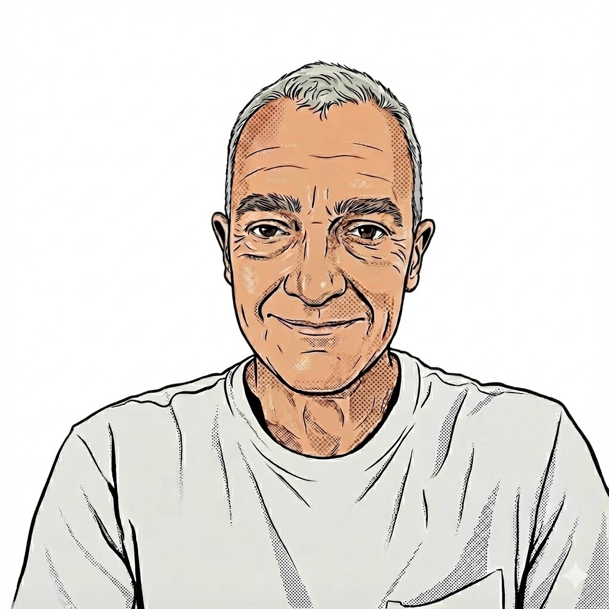

::: {.profile-header}
{.profile-img}

::: {.profile-links}
[<i class="bi bi-github"></i> GitHub](https://github.com/joelRMath)
[<i class="bi bi-envelope"></i> Email](mailto:joelrmath@gmail.com)
:::
:::

```{r, echo=FALSE, message=FALSE}
bib_lines <- readLines("references.bib")
keys <- gsub("^@.*\\{(.*),.*", "\\1", grep("^@", bib_lines, value = TRUE))

cite_pub <- function(key) {
  
  idx <- which(keys == key)
  
  if (length(idx) == 0) return(paste0("[Unknown: ", key, "]"))
  return(paste0("[[", idx, "]](publications.qmd#ref-", key, "){target=\"_blank\"}"))
}
```

## Mathematical modeling and data analysis

Modeling begins with formulating problems or phenomena at the level of concepts (conceptualization), following which the appropriate mathematical formalism is chosen. The subsequent analysis of quantitative results, or study of the model structure, can solve a problem or reveal mechanisms underlying a phenomenon.

Modeling is a universal skill, utilized across fields from physics, chemistry and biology to economics and operations research and even psychology. It is also the heart of statistics.

Efficiency in mathematical modeling requires experience and willingness to learn, as Luenberger and Ye state[^note1]:

::: {.clean-quote}
"Skill and good judgement, with respect to problem formulation and interpretation of results, is enhanced through concrete practical experience and a thorough understanding of relevant theory....Problem formulation (i.e., modeling) itself always involves a critical tradeoff between building a mathematical model sufficiently complex to accurately capture the problem description and building a model that is tractable."
:::

I am inherently multidisciplinary and enjoy tackling novel problem types. A rigorous, and also often creative, mathematical formulation allows for the translation of complex phenomena and problems into actionable insights across diverse scientific domains.


## Examples of problem solving with mathematics


### Example 1: Genesis of the Respiratory Rhythm


Biological Problem: The Nucleus Tractus Solitarius (NTS) regulates respiratory rhythms via a purely excitatory circuit lacking pacemaker cells. In vitro experiments revealed this rhythm is intrinsic and fueled by TTX-resistant background synaptic noise.

Conceptualization: The tissue was modeled as a sparse random graph of stochastic leaky integrate-and-fire neurons. To analyze the high-dimensional microscopic dynamics, the system was analytically reduced to a low-dimensional macroscopic deterministic map. This was achieved by framing the network as a nonlinear age-structured population model governed by a state-dependent Lefkovitch-style matrix.

Insight: Stability analysis proved mean network connectivity $K$ is the critical bifurcation parameter. While dense networks ($K \ge K_c$) lock into hyper-synchronized tonic firing, sparse networks ($K < K_c$) act as excitable nonlinear amplifiers where microscopic noise continuously triggers macroscopic rhythmic bursting. This demonstrated that rhythmogenesis emerges naturally from the interplay of sparse topology and stochastic noise.

Example 2: Coherence and Autonomous Stochastic Resonance

Biological Problem: Building directly on the discovery that noise fuels rhythmogenesis, this work investigated how the regularity (coherence) of these bursts is optimized in autonomous networks lacking periodic external forcing.

Conceptualization: Extending the macroscopic framework, the high-dimensional network of pulse-coupled stochastic neurons was further reduced to a simplified low-dimensional discrete map, explicitly parameterized by coupling strength ($J$) and noise variance ($\sigma^2$).

Insight: Bifurcation analysis revealed a nonmonotonic response akin to autonomous stochastic resonance: an optimal noise level maximizes rhythmic coherence by shortening inter-burst recovery intervals, while excessive noise degrades fast intra-burst firing dynamics. Furthermore, the mathematical structure rigorously proved that the robust, globally stable oscillatory regime unique to sparse networks structurally collapses into fragile bistability when the network becomes fully connected.

Example 3: Cellular Tuning and Network Bifurcation Structures

The Biological Problem: Building upon the mechanisms of noise-driven rhythmogenesis and autonomous stochastic resonance, this work investigated how the intrinsic microscopic properties of individual cells—such as firing thresholds, post-spike recovery, and synaptic delays—dictate the macroscopic state of the entire network.

Conceptualization: The macroscopic discrete map $\Phi$ was explicitly parameterized to incorporate these specific cellular traits. Rather than relying on computationally heavy $N$-dimensional simulations, rigorous bifurcation theory was applied to analytically map the system's global dynamics across the $(J, \sigma^2)$ parameter space.

Insight: The bifurcation analysis generated a comprehensive "phase diagram" detailing the exact boundaries of saddle-node and Hopf bifurcations. It revealed how the network transitions between monostable (tonic firing), bistable, and purely oscillatory regimes. Furthermore, it proved that subtle physiological adjustments—such as altering the synaptic delay $d$ or decreasing after-spike hyperpolarization $U_m$—radically shift these topological boundaries. This mathematically established how biological networks dynamically tune their global behavioral states through minor cellular modulations.

#### Network Analysis

Development and applications of fast graph-based statistical methods (Edge-Count Statistics) derived in the context of the Random Graph with Given Expected Degrees (RGGED) model[^note2] .

- **Topics**: Large and sparse network usage, fast network statistics based on RGGED modeling and data Analysis with prior knowledge, see publications `r cite_pub("JCB")`- `r cite_pub("recomb")` and the subsequent EdgeCount R package[^note3].
- **Applications**: Development of the Pathway Resource & Information System (PARIS) `r cite_pub("PARIS")`-`r cite_pub("BB")`-`r cite_pub("BIOIT")`, identification of community structures in networks `r cite_pub("Prot")`, target discovery and enhancement of result reproducibility `r cite_pub("WAP")` 
- **Programming**: R, R Package Development, R-shiny, Rmd and Java

#### Applied Mathematics and Optimization

Contributions to mathematical and numerical methods necessary for solving high-dimensional problems.

- **Topics**: Constrained Optimization (quadratic programming,  linear programming, heuristics), maximum entropy modeling, solutions to nonlinear algebraic systems.
- **Publications**: Characterization of complex molecular mixtures `r cite_pub("HS")`- `r cite_pub("HSS")`-`r cite_pub("HSE")` and their reverse engineering for multiple sclerosis `r cite_pub("Equi")`, and solutions to complex ligand-protein systems `r cite_pub("MathB")`.
- **Programming**: Java and C

#### Stochastic and Excitable Dynamical Systems

Novel work in theoretical physics and mathematical biology, focusing on stochastic noise, resonance, and rhythmic biological processes.

- **Topics**: Coherence resonance, stochastic differential equations (Fokker Planck and Langevin), nonlinear dynamical systems, stability analysis and bifurcations
- **Publications**: Noise and network-based genesis of the respiratory rhythm `r cite_pub("PRE")`-`r cite_pub("NN")`-`r cite_pub("Bios1")`-`r cite_pub("Bios2")`, noise-based switches for gene expression `r cite_pub("PNAS")`, the essential role of slow and fast dynamics in coherence resonance `r cite_pub("CR")`.
- **Programming**: C

#### Translational and Clinical Data Analysis

Statistical analyses.

- **Topics**: Data analysis and predictive modeling.
- **Publications**: H1N1 vaccination responses `r cite_pub("HIRD")`, drug equivalence `r cite_pub("Gexp")`, systemic sclerosis`r cite_pub("BioM")`-`r cite_pub("ACR17")`-`r cite_pub("PEGS")`-`r cite_pub("WAPpatent")`, and treatment responses in Long COVID `r cite_pub("axa1125")`.
- **Programming**: R and Java

### Mentorship & Leadership

I enjoy fostering a culture of collaborative problem-solving.

- **Mentorship**: Directly mentored Postdoctoral researchers and interns from MIT Electrical Engineering.

- **Leadership**: Built and led a computational biology team, organized and led weekly brainstorming meetings with focus on learning and problem solving.

- **Cross-Functional Collaboration**: Experienced in leading multidisciplinary teams and projects.

## Education

- Ph.D. Biomathematics [Paris 6, France]
- M.S. Biomathematics, Biostatistics & Bioinformatics [Paris 7, France]
- M.S. Biochemistry [Paris 7, France]

[^note1]: **Luenberger, D, and Ye, Y.** *Linear and Nonlinear Programming*, 5th ed. (Springer, 2021). [[Link to Book]](https://doi.org/10.1007/978-3-030-59322-2){target="_blank"}:

[^note2]: **Chung, F and Lu, L.** *The average distances in random graphs with given expected degrees*. (2002) PNAS, 99(25);15879--15882. [[link to Article]](https://doi.org/10.1073/pnas.252631999){target="_blank"}

[^note3]: **Pradines, J.** *EdgeCount: A package for Edge-Count based analyses.* (2025). [[Link to Package]](https://joelrmath.github.io/EdgeCount/){target="_blank"}

